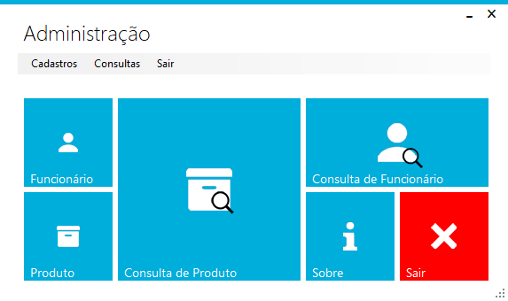

# Projeto Padaria - BakeryS
> Um sistema simples para gerenciamento de padaria, com controle de produtos e funcionários.

[![NPM Version][npm-image]]

O sistema foi criado como projeto acadêmico, para conclusão da matéria de C# do curso Análise e Desenvolvimento de Sistemas na Faculdade de Tecnologia de Itu, turma do 2º Semestre de 2017.
O objetivo do sistema é controlar os produtos de uma padaria e seu estoque, de forma simples. Além de uma tela específica para o controle de fluxo de caixa, onde seriam realizadas as vendas da padaria.

## Contato

Erick Trettel de Almeida – ericktrettel@gmail.com

[https://github.com/erickTrettel/PROJETO_Padaria](https://github.com/erickTrettel/PROJETO_Padaria)

<!-- Markdown link & img dfn's -->
[npm-image]: https://img.shields.io/badge/version-1.0.0-blue.svg